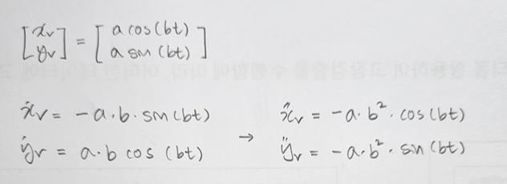
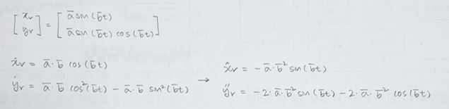

## Task 1

#### Create folder and specifies your preferred ROS version and programming language

- ROS version : ROS2 Foxy

- Programming Language : C++

## Task 2

#### Calculate general formula of $v_r$ and $w_r$

## Task 3

#### Find the formula of $\dot{x}_r$ , $\dot{y}_r$ , $\ddot{x}_r$ , and $\ddot{y}_r$ in Circle Trajectory

## Task 4

#### Find the formula of $\dot{x}_r$ , $\dot{y}_r$ , $\ddot{x}_r$ , and $\ddot{y}_r$ in 8-shape Trajectory

## Task 5

#### square trajectory using your keyboard

