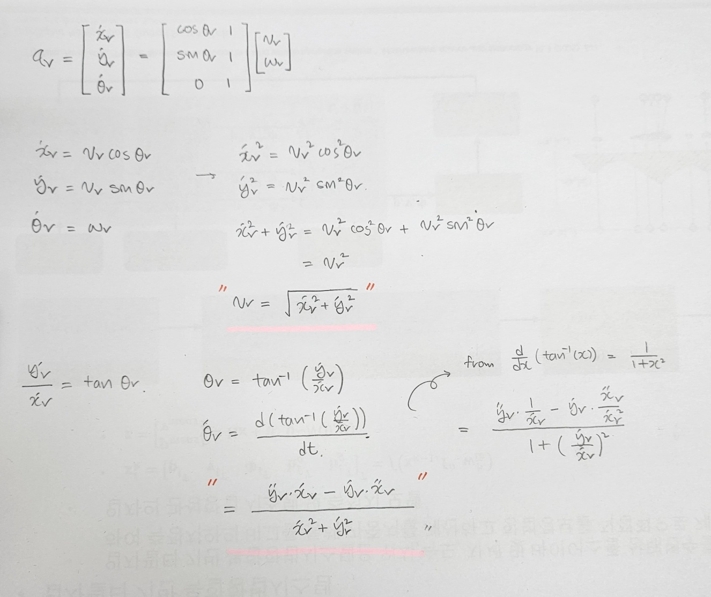

## Task 1

#### Create folder and specifies your preferred ROS version and programming language

- ROS version : ROS2 Foxy

- Programming Language : C++

## Task 2

#### Calculate general formula of $v_r$ and $w_r$

